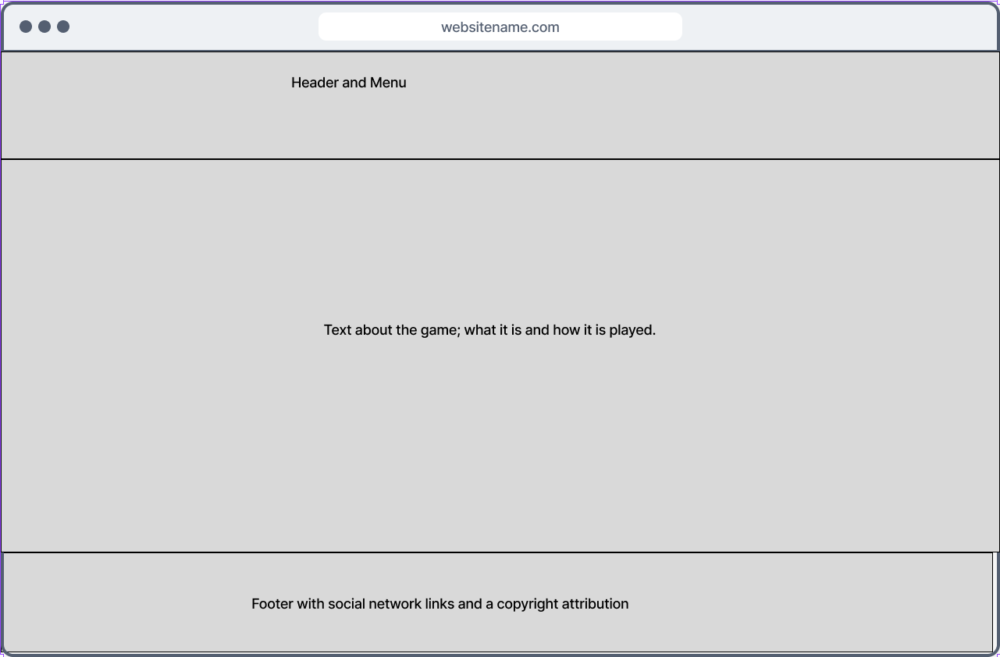
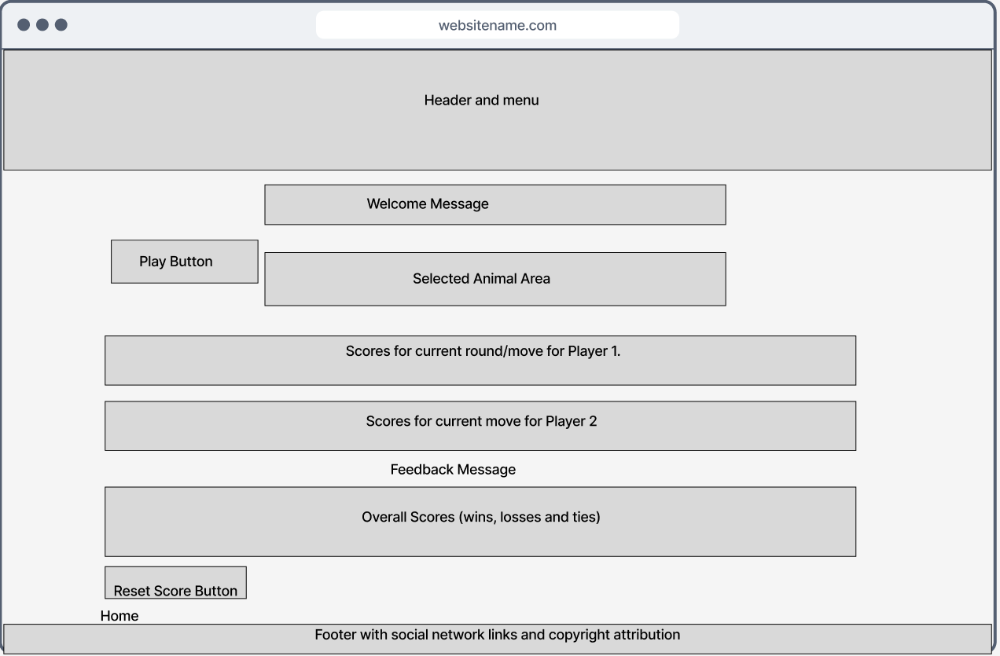

# Randomalia #

Randomalia is probability game about animals. It is designed for all age groups and arouses interest in the world of animals. What makes it special is that despite having a singe user functionality, it is also possible to imgine a or group of users having fun around it, taking advantage of its features.  

## Description ##

The game, Randomalia, is based on lists of animals grouped into  Mammals, Birds, Fish and Reptiles. Some few animals from these classes form the *Predator League*. The user plays against the computer, a.k.a. the *Animal Wizard*. On playing a class of animals is randomly selected, followed by a random selection of an animal from this class, which will be assigned to the player. The same sequence of events will happen for the *Animal Wizard*. For either animal choice, a **rankscore** based on animal class and a **survivalscore** based in membership to the *Predator League* will be computed. The  The player with a higher **Total Score** wins the round.  

The live site is available [here](https://kenarina.github.io/Owens-Homestay-Resort/)

## User stories ##

The following considerations of the user experience underly the design of the website:  

1. A simple and easily navigable, less crowded website.  

2. Brief introduction to the game and how it is played (home page).

3. Compatibility with user's device.  

4. Visually appealing, less overwhelming and fairly neutral design themes to appeal to wide range of users.   

5. Interactivity and feedback to the user e.g. through deployment of alerts.  

# UX/UI Design #

## Structure ##

The structure of the website was created based on the following wireframes crated with [Figma](https://www.figma.com/):  

## Home Page ##

The home page gives a brief description of how the game and provides a link to the game page. The footer section provides external links to social media pages and a copyright attribution.  

The page is based on this wireframe:

Wireframe for Home Page.
  

## Game Page ##

The full game page (in-play mode) has, mainly, a header section, a welcome-remark section, a chosen-animal display section, three score-display sections and a footer.The page is based on this wireframe:

Wireframe for Gallery Page.
  

## Responsive Design ##

The website has been optimised for responsive display on mobile phones, tablets, labtops and large screens, as exemplified in the images here:

  

  

## Design themes fonts. ##  

Softness and neutrality were the theme for color and font choice. The text fonts, Open Sans and Oswald from [Google Fonts](https://fonts.google.com/) were preferred for this project. The text is easy on the eye. All images used in this project were previously taken personally. They were not outsourced externally.  

## Testing ##
Basic functionality to achieve desired disign outcomes were progressively done in an iterative process. The project was written using Visual Studio Code and with a Live Server Extension *Live Preview, from Microsoft* together with inspection via the brouser console. The following tests were done manually during the coding process.  

*Functionality of internal links, including the navigation bar links.

*Functionality of external links.

Verification of responsive desing. Google Chrome, Mozilla Firefox and Microsoft Edge were successfully used for this test.  

Automatic HTML checking was done using [Nu Html Checker](https://validator.w3.org/nu/). All errors and bad code were corrected and recheked until only external links such as from Google Fonts triggered warnings.  The test results were uploaded [here](assets/test-results).

##  Technologies ##
 
[Visual Studio Code](https://code.visualstudio.com/) desktop version for HTML and CSS  
[Google Fonts](https://fonts.google.com/) for fonts.  
[favicon.io](https://favicon.io/favicon-converter/) to generate the favicon.  
[FontAwesome](https://fontawesome.com/) for icons  
[Figma](https://www.figma.com/)
[GitHub](https://github.com/) to hosting source code, to deploy and host the website.  
[Git](https://git-scm.com/) for version control.  
Microsoft Powerpoint for merging images prior to web optimisation for the readme text.  

Other resources, including course material from Code Institute, were consulted from time to time. Examples include: [StackOverflow](https://stackoverflow.com/), [W3schools](https://www.w3schools.com/) and [TutorialRepublic](https://www.tutorialrepublic.com/), [Youtube](youtube.com) . However, the course material from Code Institute was the primary resource.  

## Deployment ##

This project was deployed to GitHub pages and the site is up and running.

### Deployment procedure: ###

*Log into GitHub.  
*Select **Randomalia** from the list of repositories.  
*Select Settings and next, on the left side down-menu, select pages.  
*Under Source, select main and the *default value /(root)*.  
*Press Save.  
*A notification for deployment will appear. Refresh the page, and the link to the deployed site will be available in a green sub-section on the top of the page.  
*Click on the link to go to the live deployed page.  

The live link can be found [here](https://kenarina.github.io/Owens-Homestay-Resort/).

### How to run this project Locally (I used VSCode) ###

**Clone the repository**  

*Navigate to the **Randomalia** GitHub Repository.  
*Click the Code drop-down menu.  
*Click the HTTPS sub-heading under the Clone heading.  
*Copy the link.  
*Open VSCode.  
*Open a terminal in the directory of your choice, type git clone and paste the link.  
*A clone of the repository will now be created on your machine.  

## Acknowledgements ##

I am always grateful to Ronan McClelland, my mentor on this journey. His wealth of experience and patience have been very inspirational especially in the initial focusing of this project.
